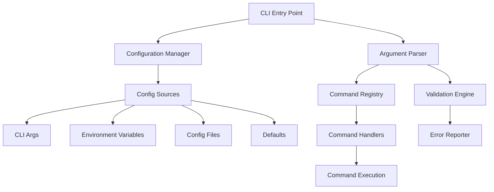

# Design Document: CLI Parameter Refactor

## Overview

This document outlines the design for refactoring the Chrome DevTools CLI parameter system to create a more maintainable, consistent, and user-friendly command-line interface. The refactor will modernize the argument parsing architecture while maintaining backward compatibility and improving the overall developer experience.

## Architecture

### High-Level Architecture



### Core Components

1. **Configuration Manager**: Centralized configuration loading and precedence handling
2. **Argument Parser**: Modern, extensible argument parsing with schema validation
3. **Command Registry**: Dynamic command registration and discovery system
4. **Validation Engine**: Comprehensive input validation with detailed error reporting
5. **Error Reporter**: Consistent error formatting and help generation
6. **Plugin System**: Extensible architecture for custom commands

## Components and Interfaces

### Configuration Manager

```typescript
interface IConfigurationManager {
  loadConfiguration(sources: ConfigSource[]): Promise<CLIConfig>;
  validateConfiguration(config: CLIConfig): ValidationResult;
  getConfigurationPrecedence(): ConfigSource[];
  resolveConfigValue<T>(key: string, type: ConfigValueType): T;
}

interface ConfigSource {
  type: 'cli' | 'env' | 'file' | 'default';
  priority: number;
  data: Record<string, unknown>;
  source?: string; // file path or env var name
}

interface CLIConfig {
  // Global options
  host: string;
  port: number;
  timeout: number;
  outputFormat: 'json' | 'text' | 'yaml';
  verbose: boolean;
  quiet: boolean;
  debug: boolean;
  
  // Advanced options
  profile?: string;
  configFile?: string;
  pluginDirs: string[];
  aliases: Record<string, string>;
  
  // Command-specific configs
  commands: Record<string, CommandConfig>;
}

interface CommandConfig {
  timeout?: number;
  retries?: number;
  defaults: Record<string, unknown>;
}
```

### Argument Parser

```typescript
interface IArgumentParser {
  parseArguments(argv: string[]): ParseResult;
  registerCommand(command: CommandDefinition): void;
  generateHelp(command?: string): string;
  validateArguments(command: string, args: ParsedArguments): ValidationResult;
}

interface CommandDefinition {
  name: string;
  aliases: string[];
  description: string;
  usage: string;
  examples: CommandExample[];
  options: OptionDefinition[];
  arguments: ArgumentDefinition[];
  subcommands?: CommandDefinition[];
}

interface OptionDefinition {
  name: string;
  short?: string;
  description: string;
  type: 'string' | 'number' | 'boolean' | 'array';
  required?: boolean;
  default?: unknown;
  choices?: string[];
  validator?: (value: unknown) => ValidationResult;
}

interface ArgumentDefinition {
  name: string;
  description: string;
  type: 'string' | 'number' | 'file' | 'url';
  required?: boolean;
  variadic?: boolean;
  validator?: (value: unknown) => ValidationResult;
}
```

### Command Registry

```typescript
interface ICommandRegistry {
  registerCommand(handler: ICommandHandler): void;
  unregisterCommand(name: string): void;
  getCommand(name: string): ICommandHandler | undefined;
  getAllCommands(): ICommandHandler[];
  resolveAlias(alias: string): string | undefined;
  loadPlugins(directories: string[]): Promise<void>;
}

interface ICommandHandler {
  getDefinition(): CommandDefinition;
  execute(args: ParsedArguments, config: CLIConfig): Promise<CommandResult>;
  validateArguments(args: ParsedArguments): ValidationResult;
  getHelp(): string;
}
```

### Validation Engine

```typescript
interface IValidationEngine {
  validateCommand(command: string, args: ParsedArguments): ValidationResult;
  validateOption(option: OptionDefinition, value: unknown): ValidationResult;
  validateArgument(argument: ArgumentDefinition, value: unknown): ValidationResult;
  validateConfiguration(config: CLIConfig): ValidationResult;
}

interface ValidationResult {
  valid: boolean;
  errors: ValidationError[];
  warnings: ValidationWarning[];
}

interface ValidationError {
  field: string;
  message: string;
  code: string;
  suggestion?: string;
}
```

## Data Models

### Configuration Precedence Model

The configuration system follows a strict precedence order (highest to lowest priority):

1. **Command-line arguments** (highest priority)
2. **Environment variables** 
3. **Configuration files** (profile-specific, then default)
4. **Default values** (lowest priority)

### Configuration File Structure

```yaml
# .chrome-cdp-cli.yaml
profile: development

# Global defaults
host: localhost
port: 9222
timeout: 30000
outputFormat: text
verbose: false
quiet: false
debug: false

# Plugin configuration
plugins:
  directories:
    - ~/.chrome-cdp-cli/plugins
    - ./plugins

# Command aliases
aliases:
  ss: screenshot
  snap: snapshot
  js: eval

# Profile-specific configurations
profiles:
  development:
    host: localhost
    port: 9222
    debug: true
    verbose: true
  
  production:
    host: chrome-server
    port: 9222
    quiet: true
    timeout: 60000

# Command-specific defaults
commands:
  screenshot:
    format: png
    quality: 90
    fullPage: false
  
  eval:
    awaitPromise: true
    returnByValue: true
```

### Command Schema Model

```typescript
interface CommandSchema {
  command: string;
  version: string;
  metadata: {
    category: string;
    tags: string[];
    stability: 'stable' | 'beta' | 'experimental';
  };
  definition: CommandDefinition;
  validation: {
    rules: ValidationRule[];
    customValidators: string[];
  };
}

interface ValidationRule {
  field: string;
  type: 'required' | 'type' | 'range' | 'pattern' | 'custom';
  constraint: unknown;
  message: string;
}
```

## Correctness Properties

*A property is a characteristic or behavior that should hold true across all valid executions of a system-essentially, a formal statement about what the system should do. Properties serve as the bridge between human-readable specifications and machine-verifiable correctness guarantees.*

Based on the prework analysis, I've identified the following correctness properties that can be validated through property-based testing:

### Property 1: Global Option Consistency
*For any* registered command, all global options should be accepted and processed identically regardless of the specific command being executed.
**Validates: Requirements 1.1**

### Property 2: Schema Validation Consistency  
*For any* command with defined options, providing options should result in validation against the command's schema, with consistent validation behavior across all commands.
**Validates: Requirements 1.2**

### Property 3: Conflict Error Reporting
*For any* set of conflicting options, the CLI should report clear error messages that include specific conflict details and actionable suggestions.
**Validates: Requirements 1.3**

### Property 4: Option Format Equivalence
*For any* option that supports both short and long forms, using either form with identical values should produce identical command execution results.
**Validates: Requirements 1.4**

### Property 5: Boolean Option Negation
*For any* boolean option, using the positive form (--verbose) and negative form (--no-verbose) should produce opposite boolean values in the parsed configuration.
**Validates: Requirements 1.5**

### Property 6: Configuration Loading Validation
*For any* valid configuration file, specifying it should result in successful loading and validation before any command execution begins.
**Validates: Requirements 2.1**

### Property 7: Environment Variable Fallback
*For any* configuration option, when not provided via CLI arguments but available as environment variables, the environment variable value should be used as the fallback.
**Validates: Requirements 2.2**

### Property 8: Configuration Precedence Rules
*For any* configuration option with values from multiple sources (CLI args, env vars, config file, defaults), the final value should follow the precedence order: CLI > env > config > defaults.
**Validates: Requirements 2.3**

### Property 9: Profile Configuration Override
*For any* configuration profile, loading the profile should correctly override base configuration values while preserving non-conflicting settings.
**Validates: Requirements 2.4**

### Property 10: Configuration Validation Error Specificity
*For any* invalid configuration, validation should fail with specific error messages that identify the exact problem and location.
**Validates: Requirements 2.5**

### Property 11: Missing Argument Error Clarity
*For any* command with required arguments, executing without those arguments should produce error messages specifying which arguments are needed and their expected formats.
**Validates: Requirements 3.1**

### Property 12: Type Validation Error Detail
*For any* argument with incorrect type, validation should fail with error messages that specify the expected type and provide examples.
**Validates: Requirements 3.2**

### Property 13: Range Validation Error Bounds
*For any* argument value outside valid ranges, validation should fail with error messages that specify the valid range or constraints.
**Validates: Requirements 3.3**

### Property 14: Path and URL Pre-validation
*For any* file path or URL argument, validation should occur before attempting to use the path/URL, catching invalid paths early.
**Validates: Requirements 3.4**

### Property 15: Validation Error Suggestions
*For any* validation failure, error messages should include suggestions for correct usage patterns.
**Validates: Requirements 3.5**

### Property 16: Command Help Completeness
*For any* registered command, using --help should display complete information including usage, options, and practical examples.
**Validates: Requirements 4.1**

### Property 17: Global Help Command Coverage
*For any* CLI instance, global --help should display all registered commands with their descriptions.
**Validates: Requirements 4.2**

### Property 18: Contextual Help on Errors
*For any* command execution that fails due to incorrect usage, contextual help suggestions should be provided.
**Validates: Requirements 4.3**

### Property 19: Complex Command Example Inclusion
*For any* command with multiple options, help output should include practical examples demonstrating common usage patterns.
**Validates: Requirements 4.4**

### Property 20: Advanced Help Topic Availability
*For any* advanced feature (configuration, scripting), dedicated help topics should be available and accessible.
**Validates: Requirements 4.5**

### Property 21: JSON Output Validity
*For any* command that returns data, using --format json should produce valid, parseable JSON output.
**Validates: Requirements 5.1**

### Property 22: Text Output Consistency
*For any* command using --format text, output should follow consistent formatting patterns across all commands.
**Validates: Requirements 5.2**

### Property 23: Quiet Mode Output Suppression
*For any* command in --quiet mode, non-essential output should be suppressed while error messages are preserved.
**Validates: Requirements 5.3**

### Property 24: Verbose Mode Information Enhancement
*For any* command in --verbose mode, output should include additional operational details and timing information.
**Validates: Requirements 5.4**

### Property 25: Error Code Specificity
*For any* command failure, the exit code should correspond to the specific type of failure that occurred.
**Validates: Requirements 6.1**

### Property 26: Network Error Classification
*For any* network-related failure, error messages should distinguish between connection, timeout, and protocol errors.
**Validates: Requirements 6.2**

### Property 27: CDP Error Detail Preservation
*For any* Chrome DevTools Protocol error, the original CDP error details should be included in the error output.
**Validates: Requirements 6.3**

### Property 28: Error Format Options
*For any* error condition, error output should be available in both human-readable and machine-parseable formats.
**Validates: Requirements 6.4**

### Property 29: Debug Mode Detail Inclusion
*For any* command in --debug mode, output should include stack traces and detailed execution logs.
**Validates: Requirements 6.5**

### Property 30: Command Alias Equivalence
*For any* command alias, using the alias should produce identical results to using the full command name.
**Validates: Requirements 7.1**

### Property 31: Alias Option Compatibility
*For any* command alias, all options available to the original command should be available to the alias.
**Validates: Requirements 7.2**

### Property 32: Custom Alias Configuration
*For any* custom alias defined in configuration, the alias should work correctly and override built-in aliases when conflicts exist.
**Validates: Requirements 7.3, 7.4**

### Property 33: Plugin Loading Success
*For any* valid plugin in specified directories, the plugin should be loaded successfully and its commands should be available.
**Validates: Requirements 8.1**

### Property 34: Plugin Interface Validation
*For any* loaded plugin, interface compatibility should be validated and incompatible plugins should be rejected with clear error messages.
**Validates: Requirements 8.2**

### Property 35: Plugin API Consistency
*For any* plugin using the standard API, command registration should work identically to built-in commands.
**Validates: Requirements 8.3**

### Property 36: Interactive Mode Functionality
*For any* interactive session, the command prompt should provide tab completion and maintain session state across commands.
**Validates: Requirements 9.1, 9.2**

### Property 37: Interactive Error Recovery
*For any* error in interactive mode, the session should continue running and allow command correction.
**Validates: Requirements 9.4**

### Property 38: Startup Performance
*For any* simple command execution, CLI startup time should be under 500ms.
**Validates: Requirements 10.1**

### Property 39: Configuration Caching
*For any* repeated configuration loading, parsed settings should be cached to avoid redundant parsing operations.
**Validates: Requirements 10.2**

### Property 40: Connection Reuse
*For any* sequence of commands requiring Chrome DevTools connections, connections should be reused rather than recreated.
**Validates: Requirements 10.3**

<function_calls>
<invoke name="prework">
<parameter name="featureName">cli-parameter-refactor

## Error Handling

### Error Classification System

The refactored CLI will implement a comprehensive error classification system with specific error codes and consistent formatting:

```typescript
enum CLIErrorCode {
  // Argument and validation errors (1xx)
  INVALID_COMMAND = 101,
  MISSING_REQUIRED_ARGUMENT = 102,
  INVALID_ARGUMENT_TYPE = 103,
  ARGUMENT_OUT_OF_RANGE = 104,
  CONFLICTING_OPTIONS = 105,
  
  // Configuration errors (2xx)
  CONFIG_FILE_NOT_FOUND = 201,
  CONFIG_VALIDATION_FAILED = 202,
  INVALID_PROFILE = 203,
  
  // Connection errors (3xx)
  CONNECTION_FAILED = 301,
  CONNECTION_TIMEOUT = 302,
  PROTOCOL_ERROR = 303,
  
  // Plugin errors (4xx)
  PLUGIN_LOAD_FAILED = 401,
  PLUGIN_VALIDATION_FAILED = 402,
  PLUGIN_CONFLICT = 403,
  
  // Runtime errors (5xx)
  COMMAND_EXECUTION_FAILED = 501,
  PERMISSION_DENIED = 502,
  RESOURCE_NOT_FOUND = 503
}
```

### Error Message Templates

Error messages will follow a consistent template structure:

```
Error: [ERROR_TYPE] - [BRIEF_DESCRIPTION]

Details: [DETAILED_EXPLANATION]

Suggestion: [ACTIONABLE_SUGGESTION]

Example: [CORRECT_USAGE_EXAMPLE]
```

### Contextual Help Integration

When commands fail due to usage errors, the CLI will automatically provide contextual help:

- Show relevant command help section
- Highlight the problematic option or argument
- Provide similar command suggestions for typos
- Include links to documentation for complex features

## Testing Strategy

### Dual Testing Approach

The CLI refactor will employ both unit testing and property-based testing for comprehensive coverage:

**Unit Tests:**
- Specific configuration loading scenarios
- Edge cases in argument parsing
- Error message formatting
- Plugin loading and validation
- Integration points between components

**Property-Based Tests:**
- Universal properties across all commands (Properties 1-40)
- Configuration precedence rules with random value combinations
- Argument validation with generated invalid inputs
- Help system completeness across all registered commands
- Performance characteristics under various loads

### Property-Based Testing Configuration

- **Testing Framework**: fast-check for TypeScript property-based testing
- **Test Iterations**: Minimum 100 iterations per property test
- **Test Tagging**: Each property test tagged with format: **Feature: cli-parameter-refactor, Property {number}: {property_text}**
- **Generators**: Smart generators for CLI arguments, configuration combinations, and command scenarios
- **Shrinking**: Automatic test case reduction to minimal failing examples

### Testing Categories

1. **Argument Parsing Tests**: Validate parsing logic with various input combinations
2. **Configuration Management Tests**: Test precedence rules and validation
3. **Command Registry Tests**: Verify command registration and discovery
4. **Error Handling Tests**: Ensure consistent error reporting and codes
5. **Performance Tests**: Validate startup time and resource usage
6. **Integration Tests**: Test end-to-end command execution flows

### Test Data Generation

Property-based tests will use intelligent generators:

```typescript
// Example generator for CLI arguments
const cliArgumentGenerator = fc.record({
  command: fc.oneof(validCommandGenerator, invalidCommandGenerator),
  options: fc.array(optionGenerator),
  arguments: fc.array(argumentGenerator),
  globalFlags: fc.record({
    verbose: fc.boolean(),
    quiet: fc.boolean(),
    debug: fc.boolean(),
    format: fc.constantFrom('json', 'text', 'yaml')
  })
});
```

The testing strategy ensures that the refactored CLI maintains reliability while introducing new features and improving user experience.