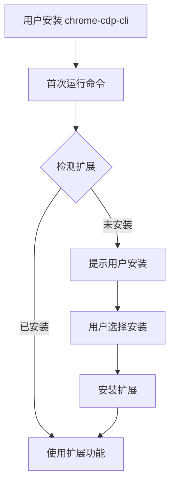

# Chrome 扩展工作流程设计

## 安装时机分析

### 场景 1：首次使用 chrome-cdp-cli（推荐时机）

**工作流程**：

```bash
# 1. 用户安装 chrome-cdp-cli
npm install -g chrome-cdp-cli

# 2. 用户首次运行命令
chrome-cdp-cli eval "document.title"

# 3. CLI 检测到没有扩展，提示用户
⚠️  Enhanced console monitoring available!
   Install Chrome extension for full console history:
   chrome-cdp-cli install-extension
   
   Or continue without extension (limited to new messages only)

# 4. 用户选择安装扩展
chrome-cdp-cli install-extension
   → 打开 Chrome Web Store 或本地安装页面
   → 引导用户完成安装

# 5. 扩展安装后，CLI 自动检测并使用
chrome-cdp-cli list_console_messages
   ✅ Extension detected! Using enhanced console monitoring.
```

### 场景 2：按需安装（用户主动）

**工作流程**：

```bash
# 用户需要历史消息功能时
chrome-cdp-cli list_console_messages
   {
     "messages": [],
     "hint": "Install extension for full console history: chrome-cdp-cli install-extension"
   }

# 用户决定安装
chrome-cdp-cli install-extension
```

### 场景 3：自动检测和提示

**工作流程**：

```bash
# CLI 在每次连接时检测扩展
chrome-cdp-cli eval "console.log('test')"

# 如果检测到扩展可用但未安装
ℹ️  Chrome extension available for enhanced features
   Run: chrome-cdp-cli install-extension
```

## 完整工作流程

### 阶段 1：CLI 安装和初始化



### 阶段 2：扩展安装流程

#### 2.1 CLI 命令：`install-extension`

```bash
chrome-cdp-cli install-extension [options]
```

**选项**：
- `--method <method>`: 安装方式
  - `store` (默认): 从 Chrome Web Store 安装
  - `local`: 从本地文件安装（开发模式）
  - `unpacked`: 加载未打包扩展（开发模式）

**实现逻辑**：

```typescript
async execute() {
  // 1. 检查 Chrome 是否运行
  if (!await this.checkChromeRunning()) {
    console.log('Please start Chrome with --remote-debugging-port=9222');
    return;
  }

  // 2. 检查扩展是否已安装
  if (await this.checkExtensionInstalled()) {
    console.log('✅ Extension already installed!');
    return;
  }

  // 3. 根据方法安装
  switch (method) {
    case 'store':
      await this.installFromStore();
      break;
    case 'local':
      await this.installFromLocal();
      break;
    case 'unpacked':
      await this.installUnpacked();
      break;
  }

  // 4. 验证安装
  await this.verifyInstallation();
}
```

#### 2.2 安装方式对比

| 方式 | 适用场景 | 优点 | 缺点 |
|------|---------|------|------|
| **Chrome Web Store** | 生产环境 | ✅ 自动更新<br>✅ 用户信任度高 | ❌ 需要发布流程<br>❌ 审核时间 |
| **本地安装** | 开发/测试 | ✅ 快速迭代<br>✅ 无需审核 | ❌ 需要手动更新<br>❌ 用户需要信任 |
| **未打包模式** | 开发调试 | ✅ 实时修改<br>✅ 调试方便 | ❌ 仅开发使用 |

### 阶段 3：扩展检测机制

#### 3.1 检测方法

**方法 1：通过 CDP 检测扩展 ID**

```typescript
async checkExtensionInstalled(): Promise<boolean> {
  try {
    // 通过 CDP 查询扩展
    const result = await this.client.send('Runtime.evaluate', {
      expression: `
        (function() {
          // 检查扩展注入的全局变量
          return typeof window._chromeCdpCliConsoleLogs !== 'undefined';
        })()
      `
    });
    return result.value === true;
  } catch (error) {
    return false;
  }
}
```

**方法 2：通过 Chrome Extension API**

```typescript
async checkExtensionInstalled(): Promise<boolean> {
  try {
    // 查询 Chrome 扩展列表（需要特殊权限）
    const extensions = await this.queryChromeExtensions();
    return extensions.some(ext => 
      ext.id === CHROME_CDP_CLI_EXTENSION_ID
    );
  } catch (error) {
    // 回退到方法 1
    return await this.checkExtensionInstalledViaCDP();
  }
}
```

**方法 3：通过页面注入检测**

```typescript
async checkExtensionInstalled(): Promise<boolean> {
  try {
    // 尝试通过 eval 检测扩展标记
    const result = await this.client.send('Runtime.evaluate', {
      expression: `
        window.chrome?.runtime?.id === '${EXTENSION_ID}' ||
        document.querySelector('script[data-chrome-cdp-cli]') !== null
      `
    });
    return result.value === true;
  } catch (error) {
    return false;
  }
}
```

#### 3.2 检测时机

```typescript
class CLIApplication {
  async runCommand(command: CLICommand) {
    // 1. 连接 Chrome
    await this.ensureConnection(command);

    // 2. 检测扩展（如果命令需要）
    if (this.needsExtension(command.name)) {
      const hasExtension = await this.detectExtension();
      
      if (!hasExtension && command.config.requireExtension) {
        throw new Error('Extension required. Run: chrome-cdp-cli install-extension');
      }
      
      if (hasExtension) {
        this.logger.info('✅ Using enhanced console monitoring via extension');
      }
    }

    // 3. 执行命令
    return await this.executeCommand(command);
  }
}
```

### 阶段 4：使用扩展功能

#### 4.1 增强的 Console Monitoring

**无扩展时**：
```bash
chrome-cdp-cli list_console_messages
# 只能获取监控开始后的消息
```

**有扩展时**：
```bash
chrome-cdp-cli list_console_messages
# 可以获取从页面加载开始的所有消息
```

**实现逻辑**：

```typescript
async listConsoleMessages() {
  const messages = [];

  // 1. 尝试从扩展获取历史消息
  try {
    const extensionMessages = await this.getExtensionMessages();
    messages.push(...extensionMessages);
  } catch (error) {
    // 扩展不可用，继续使用 CDP 方式
  }

  // 2. 获取 CDP 实时消息
  const cdpMessages = await this.getCDPMessages();
  messages.push(...cdpMessages);

  // 3. 去重和排序
  return this.deduplicateAndSort(messages);
}
```

#### 4.2 扩展数据格式

```typescript
interface ExtensionConsoleMessage {
  type: 'log' | 'info' | 'warn' | 'error' | 'debug';
  args: unknown[];
  timestamp: number;
  stack?: string;
  url?: string;
  lineNumber?: number;
}
```

### 阶段 5：扩展生命周期管理

#### 5.1 扩展更新检测

```typescript
async checkExtensionUpdate(): Promise<void> {
  const currentVersion = await this.getExtensionVersion();
  const latestVersion = await this.getLatestVersionFromStore();
  
  if (currentVersion < latestVersion) {
    this.logger.warn(
      `Extension update available: ${latestVersion}. ` +
      `Run: chrome-cdp-cli install-extension --update`
    );
  }
}
```

#### 5.2 扩展卸载

```bash
chrome-cdp-cli uninstall-extension
```

**工作流程**：
1. 检测扩展是否安装
2. 提示用户确认
3. 通过 Chrome Extension API 卸载
4. 清理相关配置

## 用户体验流程示例

### 场景 A：新用户完整流程

```bash
# Step 1: 安装 CLI
$ npm install -g chrome-cdp-cli
✅ Installed chrome-cdp-cli@1.5.0

# Step 2: 启动 Chrome
$ chrome --remote-debugging-port=9222

# Step 3: 首次使用
$ chrome-cdp-cli eval "document.title"
ℹ️  Enhanced features available with Chrome extension
   Install: chrome-cdp-cli install-extension
   Or continue without extension

# Step 4: 用户选择安装扩展
$ chrome-cdp-cli install-extension
📦 Opening Chrome Web Store...
   → User installs extension in Chrome
✅ Extension installed! Restart Chrome to activate.

# Step 5: 重启 Chrome 后使用
$ chrome-cdp-cli list_console_messages
✅ Extension detected! Using enhanced console monitoring.
{
  "messages": [
    {"type": "log", "text": "Page loaded", "timestamp": 1234567890},
    {"type": "warn", "text": "Deprecated API", "timestamp": 1234567900}
  ],
  "source": "extension"
}
```

### 场景 B：开发模式流程

```bash
# Step 1: 开发扩展
$ cd chrome-cdp-cli-extension
$ npm run build

# Step 2: 本地安装
$ chrome-cdp-cli install-extension --method local --path ./dist
📦 Installing extension from local path...
✅ Extension installed (development mode)

# Step 3: 测试
$ chrome-cdp-cli list_console_messages
✅ Using extension (dev mode)
```

### 场景 C：无扩展使用（向后兼容）

```bash
# 用户不安装扩展，CLI 仍然可用
$ chrome-cdp-cli eval "document.title"
"Example Domain"

$ chrome-cdp-cli list_console_messages
{
  "messages": [],
  "hint": "Install extension for full console history",
  "source": "cdp"
}
```

## 命令设计

### 新增命令

#### 1. `install-extension`

```bash
chrome-cdp-cli install-extension [options]

Options:
  --method <method>    安装方式: store|local|unpacked (default: store)
  --path <path>        本地扩展路径（local/unpacked 模式）
  --id <id>            扩展 ID（用于检测）
  --force               强制重新安装
  --check-only         仅检查是否已安装，不安装
```

#### 2. `uninstall-extension`

```bash
chrome-cdp-cli uninstall-extension [options]

Options:
  --confirm             跳过确认提示
```

#### 3. `extension-status`

```bash
chrome-cdp-cli extension-status

输出:
{
  "installed": true,
  "version": "1.0.0",
  "active": true,
  "lastCheck": "2024-01-01T00:00:00Z"
}
```

### 现有命令增强

#### `list_console_messages` 增强

```bash
chrome-cdp-cli list_console_messages [options]

新增选项:
  --source <source>    消息来源: extension|cdp|all (default: all)
  --require-extension  如果扩展未安装则报错
```

## 实现优先级

### Phase 1: 基础功能（MVP）
- [ ] `install-extension` 命令（Chrome Web Store）
- [ ] 扩展检测机制
- [ ] 基础 console 消息读取

### Phase 2: 增强功能
- [ ] 本地安装支持
- [ ] 扩展更新检测
- [ ] `extension-status` 命令

### Phase 3: 高级功能
- [ ] 扩展配置管理
- [ ] 多扩展支持
- [ ] 扩展调试工具

## 技术实现要点

### 1. 扩展 ID 管理

```typescript
// config/extension.ts
export const EXTENSION_CONFIG = {
  STORE_ID: 'chrome-cdp-cli-extension-id',
  LOCAL_ID: 'local-development-id',
  MANIFEST_VERSION: 3
};
```

### 2. 检测逻辑

```typescript
class ExtensionDetector {
  async detect(): Promise<ExtensionStatus> {
    // 1. 尝试通过 CDP 检测
    const cdpDetected = await this.detectViaCDP();
    
    // 2. 尝试通过 Chrome API 检测
    const apiDetected = await this.detectViaAPI();
    
    return {
      installed: cdpDetected || apiDetected,
      method: cdpDetected ? 'cdp' : 'api',
      version: await this.getVersion()
    };
  }
}
```

### 3. 向后兼容

```typescript
class ConsoleMonitor {
  async getMessages(): Promise<ConsoleMessage[]> {
    // 1. 尝试扩展方式
    try {
      if (await this.extensionDetector.isInstalled()) {
        return await this.getExtensionMessages();
      }
    } catch (error) {
      // 扩展不可用，继续
    }
    
    // 2. 回退到 CDP 方式
    return await this.getCDPMessages();
  }
}
```

## 总结

### 安装时机建议

1. **首次使用提示**：用户首次运行需要扩展功能的命令时
2. **按需安装**：用户需要历史消息功能时
3. **可选安装**：不强制，保持向后兼容

### 工作流程要点

1. **检测优先**：每次命令执行时检测扩展
2. **优雅降级**：无扩展时回退到 CDP 方式
3. **用户友好**：清晰的提示和安装指引
4. **向后兼容**：不安装扩展也能正常使用

### 设计原则

- ✅ **可选功能**：扩展是可选的，不是必需的
- ✅ **向后兼容**：不破坏现有功能
- ✅ **用户友好**：清晰的安装和使用指引
- ✅ **开发友好**：支持本地开发和调试

